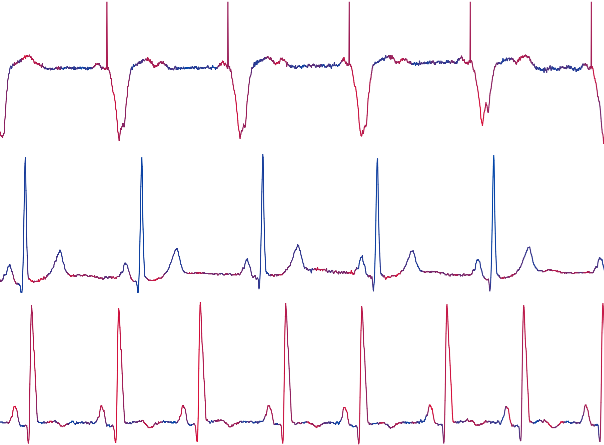
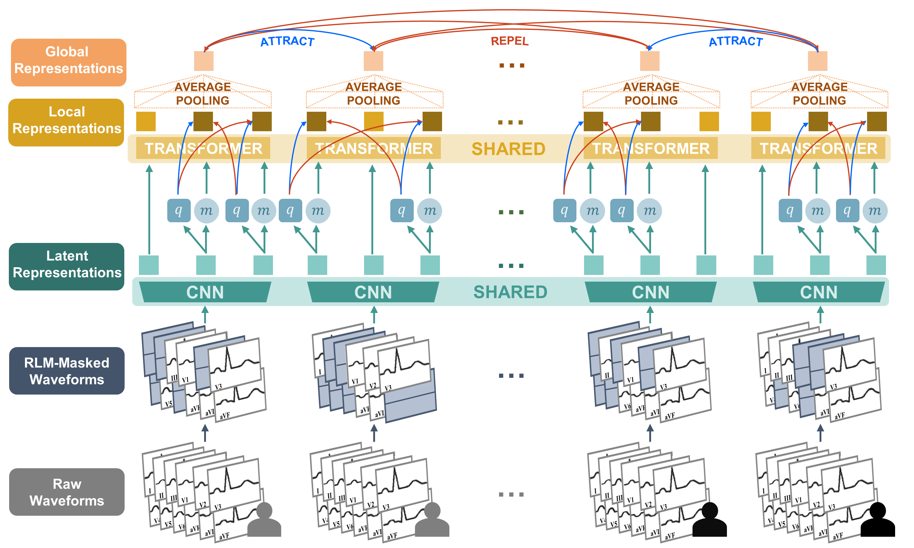

<div align="center">
  
  <br />
  <br />
  <a href="https://github.com/bowang-lab/ECG-FM/blob/main/LICENSE/"></a>
  <a href="https://arxiv.org/abs/2408.05178"></a>
  <!-- https://academia.stackexchange.com/questions/27341/flair-badge-for-arxiv-paper -->
  <!-- https://img.shields.io/badge/<SUBJECT>-<IDENTIFIER>-<COLOR>?logo=<SIMPLEICONS NAME>&logoColor=<LOGO COLOR> -->

</div>

--------------------------------------------------------------------------------

ECG-FM is a foundation model for electrocardiogram (ECG) analysis. Committed to open-source practices, ECG-FM was developed in collaboration with the [fairseq_signals](https://github.com/Jwoo5/fairseq-signals) framework, which implements a collection of deep learning methods for ECG analysis. This repository serves as a landing page and will host project-specific scripts as this work progresses.

<div align="center">
  
</div>

## Getting Started

### 🛠️ Installation
Clone [fairseq_signals](https://github.com/Jwoo5/fairseq-signals) and refer to the requirements and installation section in the top-level README.

### 🚀 Quick Start
Please refer to our [inference quickstart tutorial](https://github.com/bowang-lab/ECG-FM/blob/main/notebooks/infer_quickstart.ipynb), which outlines inference and visualization pipelines.

### 📦 Model
Model checkpoints have been made publicly available for [download on HuggingFace](https://huggingface.co/wanglab/ecg-fm). Specifically, there is:

`mimic_iv_ecg_physionet_pretrained.pt`
- Pretrained on [MIMIC-IV-ECG v1.0](https://physionet.org/content/mimic-iv-ecg/1.0/) and [PhysioNet 2021 v1.0.3](https://physionet.org/content/challenge-2021/1.0.3/).

`mimic_iv_ecg_finetuned.pt`
- Finetuned from `mimic_iv_ecg_physionet_pretrained.pt` on [MIMIC-IV-ECG v1.0 dataset](https://physionet.org/content/mimic-iv-ecg/1.0/).

ECG-FM has 90.9 million parameters, adopts the wav2vec 2.0 architecture, and was pretrained using the W2V+CMSC+RLM (WCR) method. Further details are available in our [paper](https://arxiv.org/abs/2408.05178).

<div align="center">
  
</div>

### 🫀 Data Preparation
We implemented a flexible, end-to-end, multi-source data preprocessing pipeline. Please refer to it [here](https://github.com/Jwoo5/fairseq-signals/tree/master/scripts/preprocess/ecg).

### ⚙️ Command-line Usage
The [command-line inference tutorial](https://github.com/bowang-lab/ECG-FM/blob/main/notebooks/infer_cli.ipynb) describes the result extraction and post-processing. There is also a script for performing linear probing experiments.

All training is performed through the [fairseq_signals](https://github.com/Jwoo5/fairseq-signals) framework. To maximize reproducibility, we have provided [configuration files](https://huggingface.co/wanglab/ecg-fm).

#### Pretraining
Our pretraining uses the `mimic_iv_ecg_physionet_pretrained.yaml` config (can modify [w2v_cmsc_rlm.yaml](https://github.com/Jwoo5/fairseq-signals/blob/master/examples/w2v_cmsc/config/pretraining/w2v_cmsc_rlm.yaml) as desired).

After modifying the relevant configuration file as desired, pretraining is performed using hydra's command line interface. This command highlights some popular config overrides:
```
FAIRSEQ_SIGNALS_ROOT="<TODO>"
MANIFEST_DIR="<TODO>/cmsc"
OUTPUT_DIR="<TODO>"

fairseq-hydra-train \
    task.data=$MANIFEST_DIR \
    dataset.valid_subset=valid \
    dataset.batch_size=64 \
    dataset.num_workers=10 \
    dataset.disable_validation=false \
    distributed_training.distributed_world_size=4 \
    optimization.update_freq=[2] \
    checkpoint.save_dir=$OUTPUT_DIR \
    checkpoint.save_interval=10 \
    checkpoint.keep_last_epochs=0 \
    common.log_format=csv \
    --config-dir $FAIRSEQ_SIGNALS_ROOT/examples/w2v_cmsc/config/pretraining \
    --config-name w2v_cmsc_rlm
```

*Notes:*
- With CMSC pretraining, the batch size refers to pairs of adjacent segments. Therefore, the effective pretraining batch size is `64 pairs * 2 segments per pair * 4 GPUs * 2 gradient accumulations (update_freq) = 1024 segments`.

#### Finetuning
Our finetuning uses the `mimic_iv_ecg_finetuned.yaml` config (can modify [diagnosis.yaml](https://github.com/Jwoo5/fairseq-signals/blob/master/examples/w2v_cmsc/config/finetuning/ecg_transformer/diagnosis.yaml) as desired).

This command highlights some popular config overrides:
```
FAIRSEQ_SIGNALS_ROOT="<TODO>"
PRETRAINED_MODEL="<TODO>"
MANIFEST_DIR="<TODO>"
LABEL_DIR="<TODO>"
OUTPUT_DIR="<TODO>"
NUM_LABELS=$(($(wc -l < "$LABEL_DIR/label_def.csv") - 1))
POS_WEIGHT=$(cat $LABEL_DIR/pos_weight.txt)

fairseq-hydra-train \
    task.data=$MANIFEST_DIR \
    model.model_path=$PRETRAINED_MODEL \
    model.num_labels=$NUM_LABELS \
    optimization.lr=[1e-06] \
    optimization.max_epoch=140 \
    dataset.batch_size=256 \
    dataset.num_workers=5 \
    dataset.disable_validation=true \
    distributed_training.distributed_world_size=1 \
    distributed_training.find_unused_parameters=True \
    checkpoint.save_dir=$OUTPUT_DIR \
    checkpoint.save_interval=1 \
    checkpoint.keep_last_epochs=0 \
    common.log_format=csv \
    +task.label_file=$LABEL_DIR/y.npy \
    +criterion.pos_weight=$POS_WEIGHT \
    --config-dir $FAIRSEQ_SIGNALS_ROOT/examples/w2v_cmsc/config/finetuning/ecg_transformer \
    --config-name diagnosis
  ```

### 🏷️ Labeler
Functionality for our comphensive free-text pattern matching and knowledge graph-based label manipulation is showcased in the [labeler.ipynb](https://github.com/bowang-lab/ECG-FM/blob/main/notebooks/infer_quickstart.ipynb) notebook.

## 💬 Questions
Inquiries may be directed to kaden.mckeen@mail.utoronto.ca.
